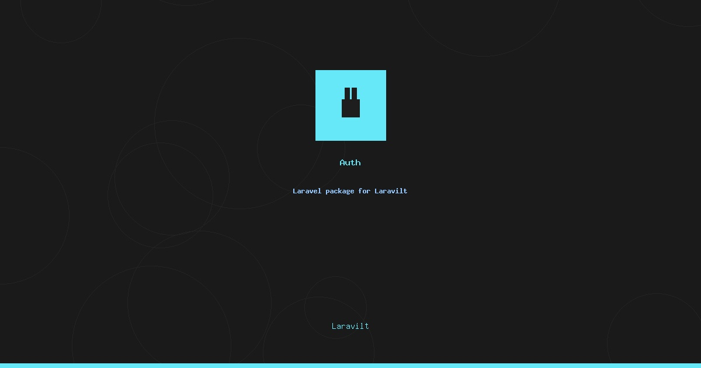

# Laravilt Auth

[](https://packagist.org/packages/laravilt/auth)
[](https://packagist.org/packages/laravilt/auth)
[](https://packagist.org/packages/laravilt/auth)
[](https://github.com/laravilt/auth/actions/workflows/dependabot/dependabot-updates)
[](https://github.com/laravilt/auth/actions/workflows/fix-php-code-styling.yml)
[](https://github.com/laravilt/auth/actions/workflows/tests.yml)

Complete authentication system for Laravilt with 8 authentication methods, 20+ events, custom pages, and multi-panel support.

## Features

### 🔐 8 Authentication Methods

1. **Standard Login & Registration** - Email/password authentication with remember me
2. **OTP Email Verification** - One-time passwords sent via email
3. **Two-Factor Authentication** - TOTP (Google Authenticator) and email codes
4. **Password Reset** - Secure password reset flow with email links
5. **Social Authentication** - OAuth login (GitHub, Google, Facebook, Twitter, etc.)
6. **Passkey Authentication** - WebAuthn passwordless biometric login
7. **Magic Links** - Passwordless one-click email authentication
8. **Connected Accounts** - Link multiple auth providers to one account

### 📡 20+ Events

- `LoginAttempt`, `LoginSuccessful`, `LoginFailed`
- `RegistrationAttempt`, `RegistrationCompleted`
- `OtpSent`, `OtpVerified`, `OtpFailed`
- `TwoFactorEnabled`, `TwoFactorDisabled`, `TwoFactorChallengeFailed`, `TwoFactorChallengeSuccessful`
- `PasswordResetRequested`, `PasswordReset`
- `SocialAuthenticationAttempt`, `SocialAuthenticationFailed`, `SocialAuthenticationSuccessful`
- `PasskeyRegistered`, `PasskeyAuthenticated`
- `MagicLinkSent`

### 🎨 Custom Pages & Multi-Panel Support

Replace any page and configure different authentication methods per panel.

## Installation

### Composer

```bash
composer require laravilt/auth
```

### NPM

```bash
npm install @laravilt/auth
```

## Quick Start

### Basic Panel Setup

```php
use Laravilt\Panel\Panel;

Panel::make('admin')
    ->login()                              // Enable login
    ->registration()                       // Enable registration
    ->passwordReset()                      // Enable password reset
    ->emailVerification()->otp()           // Enable OTP verification
    ->twoFactor()                          // Enable 2FA
    ->socialAuth(['github', 'google'])     // Enable social auth
    ->passkeys()                           // Enable passkeys
    ->magicLinks();                        // Enable magic links
```

### Custom Pages

```php
use App\Auth\CustomLogin;

Panel::make('admin')
    ->login(CustomLogin::class);  // Use custom login page
```

### Event Listeners

```php
use Laravilt\Auth\Events\LoginSuccessful;

Event::listen(LoginSuccessful::class, function ($event) {
    Log::info('User logged in: ' . $event->user->email);
});
```

## Vue/TypeScript Usage

```typescript
import { LoginPage, RegisterPage } from '@laravilt/auth'
import { useAuth } from '@laravilt/auth'

const { user, logout } = useAuth()
```

## Publishing

### Build for NPM

```bash
npm run build:npm
```

### Publish to NPM

```bash
npm publish --access public
```

### Publish to Packagist

```bash
git tag v1.0.0
git push origin master --tags
```

## MCP Server

AI-assisted development with MCP tools:
- `search-docs` - Search auth documentation
- `get-event-info` - Get event details
- `list-auth-methods` - List authentication methods

## Documentation

- **Complete Docs**: `docs/index.md`
- **Test Summary**: `TEST_SUMMARY.md`
- **Website**: https://laravilt.dev/auth

## Testing

```bash
composer test
```

**Coverage**: 26 tests | 70 assertions | All events tested

## Requirements

- PHP 8.3+
- Laravel 12+
- Vue 3.3+
- Inertia.js 2.0+

## License

MIT License - see [LICENSE.md](LICENSE.md)

## Credits

**Author**: Fady Mondy (info@3x1.io)
**Website**: https://laravilt.dev
